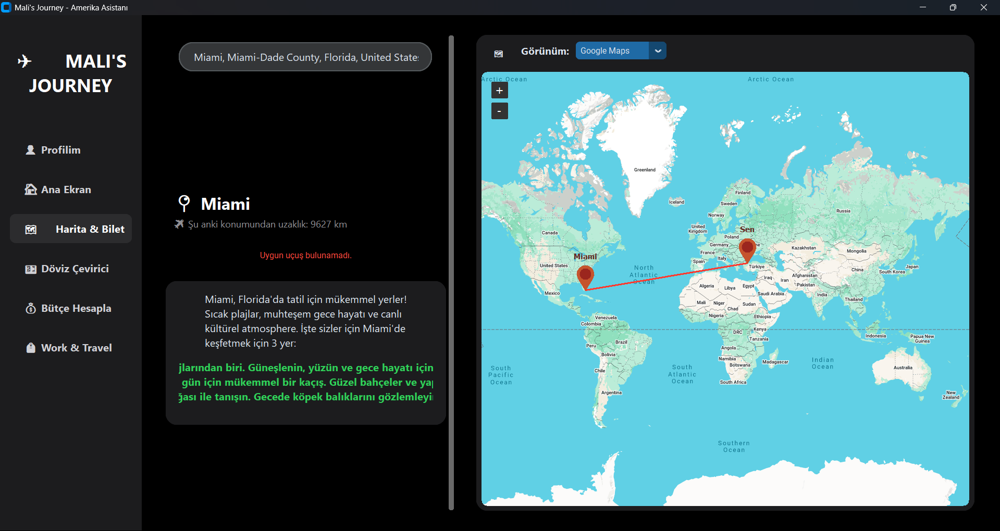
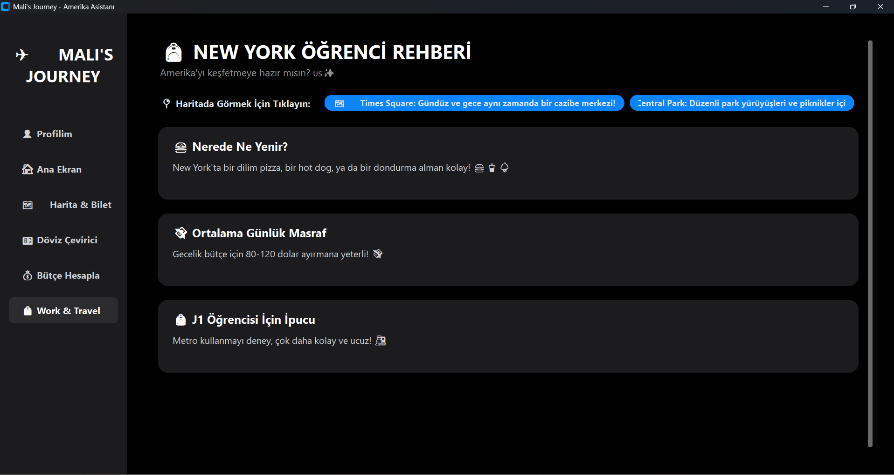

# ✈️ Mali's Journey: AI-Powered Work & Travel Assistant

## 📌 Overview
**Mali's Journey** is a comprehensive, desktop-based AI assistant designed specifically for J1 Work & Travel students and travelers. Built with a modern, dark-themed UI, it combines real-time data, artificial intelligence, and financial planning tools into a single ecosystem to streamline the US travel and working experience.

Instead of navigating between a dozen different apps for maps, flights, budget planning, and city guides, this application serves as a centralized hub.

## 🚀 Key Features

* **🤖 AI City & W&T Guide:** Integrates the Groq API (Llama 3.1) to generate instant, personalized city guides, student-friendly dining tips, and budget advice for any US city.
* **🗺️ Interactive Map & Real-Time Flights:** Utilizes `tkintermapview` and `geopy` to calculate distances and render routes. Automatically fetches the cheapest real-time flight tickets to the nearest major airport using SerpAPI.
* **💰 Smart Budget Planner:** A multi-job salary calculator that estimates 3-month net savings by factoring in hourly wages, weekly hours, estimated tax deductions (~12%), and living expenses.
* **⚡ Asynchronous Operations:** Implements Python `threading` for all API calls (Groq, SerpAPI, Exchange Rates) to prevent UI blocking, ensuring a buttery-smooth user experience.
* **🕒 Live Dashboard:** Features a dynamic US timezone selector, live USD/TRY exchange rates, and a countdown timer to the flight date.

## 📸 Screenshots

## 🛠️ Tech Stack & Architecture

* **Language:** Python
* **GUI Framework:** CustomTkinter (for a modern, rounded, dark-mode interface)
* **AI Engine:** Groq API (Llama-3.1-8b-instant)
* **APIs & Data:** SerpAPI (Google Flights), ExchangeRate-API
* **Mapping & Geolocation:** Geopy, TkinterMapView, Geocoder
* **Security:** `python-dotenv` for local environment variable management

## ⚙️ Installation & Setup

**1. Clone the repository**

[git clone [https://github.com/yourusername/Malis-Journey-AI.git](https://github.com/yourusername/Malis-Journey-AI.git)
cd Malis-Journey-AI](https://github.com/Maelor1/Work-and-Travel-AI-Assistant.git)

**2.Install Dependencies**
pip install -r requirements.txt

**3. API Keys**
For security reasons, API keys are not included in this repository. Create a .env file in the root directory and add your own keys:
GROQ_API_KEY=your_groq_api_key_here
SERPAPI_KEY=your_serpapi_key_here

**4. Run the application**
python src/main_app.py

🧠 Why I Built This
I developed this project to solve a personal pain point while planning my own Work & Travel journey to Icona Avalon, NJ. It serves as a practical application of integrating Large Language Models (LLMs) into traditional software architecture, utilizing asynchronous programming, and designing user-centric interfaces.

👨‍💻 Author
Mehmet Ali Ordu

* LinkedIn: [Mehmet Ali Ordu](https://tr.linkedin.com/in/mehmet-ali-ordu-41a046244)

* GitHub: [@Maelor1](https://github.com/Maelor1)
